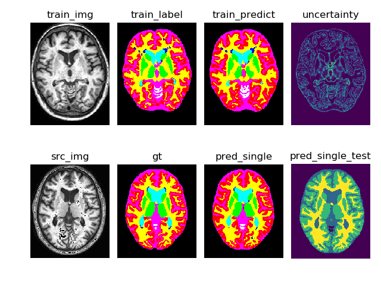

# MRBrainS18
This code is written to participate in the [MRBrainS18](http://mrbrains18.isi.uu.nl/) competition.

The method we use comes from this paper:
[From neonatal to adult brain
mr image segmentation in a few seconds using 3d-like fully convolutional network and transfer learning](https://www.lrde.epita.fr/wiki/Publications/xu.17.icip)

## Preprocess:
1)histogram equalization(only for T1);

2)stack 3 continue slices as a RGB image;

3)flip and rotate for [$0,\pm 5,\pm 10,\pm 15$] for data augmentation;

4)crop to reduce background in image and ensure width and height can be devided by 16;


## Network
Simply pass image in 3 modalities through 3 streams of VGG, and concat them in every stage.


## Run

```
python ./train.py --gpu_id=0 --data_path='path' --val_num=1 
```

The meaning of this line of code is running this code with GPU 0 and validating with sample 1.

## Code explanation
Main file is 'train.py', includes train and validation process. 

folder 'data\_loader' includes preprocess code and dataloader. 

folder 'models' includes some networks. 

'loss.py' defines sone loss functions. 

'metrics.py' computes dice coefficients. 

'validate.py' generates '.nii.gz' file for validation set. 

'test.py' is an independent file to generate '.nii.gz' file for test sample. 

folder 'fig\_out' storages visualized results and train curve, in png foramt. 

'evaluation.py' is modified from [official code](https://github.com/hjkuijf/MRBrainS18/blob/master/evaluation.py) to compute metrics. 
	
folder 'evaluation' storages output '.nii.gz' and label '.nii.gz' for computing metrics. 

folder 'docker' is used to containerize test code. 

folder 'documents' contains poster,slides,description and results for extension of icip paper.


## Visualization

